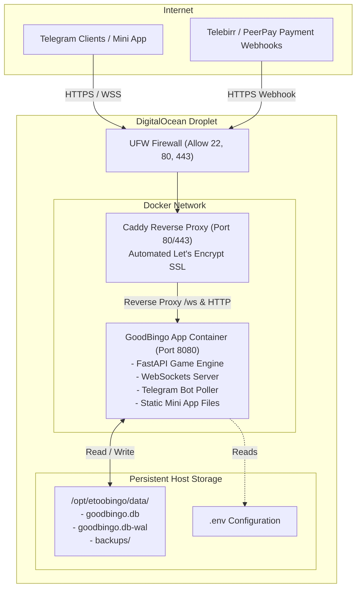

# DigitalOcean Migration & 24/7 Production Deployment Guide

## 1. Executive Summary & Root Cause Analysis

### Why Render Was Failing
1. **15-Minute Inactivity Sleep:** Render free tier spins down any web service that has had no inbound HTTP traffic for 15 minutes.
2. **Broken Telegram Polling & WebSockets:** When Render sleeps the container, the Python process freezes. Telegram long-polling stops, WebSocket connections are abruptly disconnected, active bingo rooms freeze, and players are disconnected.
3. **Internal Self-Ping Ineffectiveness:** The in-process `_self_ping_loop()` (pinging `http://127.0.0.1:8080/healthz`) does not prevent Render from sleeping because Render's sleep detection relies on inbound requests through its external edge proxy. Furthermore, external pings quickly exhaust Render's 750 free-hour monthly pool.
4. **Severe CPU Throttling:** Render free tier allocates shared fractional vCPU (often throttled down to ~0.1 vCPU), causing number-drawing delays, WebSocket broadcast latency, and degraded gameplay.
5. **Ephemeral Storage:** On Render free tier, the local filesystem is ephemeral. Server restarts or deploys risk wiping SQLite data unless paying extra for Render Disks ($7/mo).

### Why DigitalOcean Solves All Issues
- **Zero Sleeping (True 24/7):** A DigitalOcean Droplet is a dedicated Virtual Private Server (KVM VM). It runs continuously 365 days a year without idle timers.
- **Predictable Performance:** Dedicated baseline CPU and RAM ensure steady WebSocket latency and smooth real-time bingo number broadcasting.
- **Persistent SSD Storage:** Local NVMe/SSD storage retains `goodbingo.db`, WAL logs, and player state across app restarts, reboots, and redeploys.
- **Full Root Control:** Ability to configure systemd, Docker, swap memory, custom firewall (UFW), and automated backups.
- **Fixed, Cost-Effective Pricing:** Basic Droplets start at \$4 to \$6/month with 1GB RAM and 25GB SSD (or \$12/month for 2GB RAM / 50GB NVMe SSD).

---

## 2. Recommended Infrastructure & Sizing

| Component | Specification | Notes |
| :--- | :--- | :--- |
| **Droplet Plan** | Basic Droplet (Regular or Premium AMD/Intel) | \$6/mo (1 vCPU, 1GB RAM, 25GB SSD) or \$12/mo (1 vCPU, 2GB RAM, 50GB NVMe) |
| **OS** | Ubuntu 24.04 LTS (x64) | Long-term support, standard system packages |
| **Datacenter** | Frankfurt (`fra1`) or Amsterdam (`ams3`) | Closest low-latency routes to Ethiopia (Ethio Telecom / Telebirr) |
| **Swap Space** | 2 GB Swapfile | Prevents OOM kills during build / peak traffic bursts |
| **Reverse Proxy** | Caddy or Nginx + Certbot | Caddy provides zero-config automated Let's Encrypt SSL and native WebSocket proxying |
| **Container Engine**| Docker + Docker Compose | Isolates dependencies, enables one-command deployments and auto-restart |
| **Database** | SQLite 3 (WAL mode) on persistent host volume | Pre-tuned in `bot/database.py` with 8MB cache, WAL mode, and busy timeout |

---

## 3. Architecture Overview



---

## 4. Step-by-Step Implementation Guide

### Phase 1: Droplet Provisioning & Initial Setup

1. **Create Droplet in DigitalOcean Console:**
   - Image: **Ubuntu 24.04 LTS x64**
   - Size: **Basic** -> **Regular (\$6/mo - 1GB RAM, 25GB SSD)** or **Premium Intel/AMD (\$12/mo - 2GB RAM, 50GB NVMe)**
   - Region: **Frankfurt (`fra1`)**
   - Authentication: **SSH Key** (recommended) or root password
   - Hostname: `etoobingo-prod`

2. **Connect via SSH:**
   ```bash
   ssh root@<YOUR_DROPLET_IP>
   ```

3. **Configure 2GB Swap (Crucial for 1GB Droplet stability):**
   ```bash
   fallocate -l 2G /swapfile
   chmod 600 /swapfile
   mkswap /swapfile
   swapon /swapfile
   echo '/swapfile none swap sw 0 0' >> /etc/fstab
   ```

4. **Install Docker & Docker Compose:**
   ```bash
   apt update && apt upgrade -y
   apt install -y curl git ufw sqlite3
   curl -fsSL https://get.docker.com -o get-docker.sh
   sh get-docker.sh
   apt install -y docker-compose-plugin
   ```

5. **Configure Firewall (UFW):**
   ```bash
   ufw default deny incoming
   ufw default allow outgoing
   ufw allow 22/tcp    # SSH
   ufw allow 80/tcp    # HTTP (Let's Encrypt verification)
   ufw allow 443/tcp   # HTTPS & WSS
   ufw enable
   ```

---

### Phase 2: Domain & DNS Configuration

Telegram WebApps and Telebirr/PeerPay webhooks **strictly require a valid HTTPS domain**.

1. **Set Up DNS Record:**
   - In your domain registrar or Cloudflare:
     - Record Type: `A`
     - Host: `bingo` (or `@` for apex domain)
     - Value: `<YOUR_DROPLET_IP>`
     - TTL: Auto or 300 seconds
   - Example: `bingo.yourdomain.com` -> `<YOUR_DROPLET_IP>`

---

### Phase 3: Project Deployment Configuration

We will place production files under `/opt/etoobingo`.

#### 1. `docker-compose.yml`
```yaml
services:
  app:
    build:
      context: .
      dockerfile: Dockerfile
    restart: always
    environment:
      - SERVER_PORT=8080
      - DATABASE_PATH=/data/goodbingo.db
      - PYTHONUNBUFFERED=1
    env_file:
      - .env
    volumes:
      - ./data:/data
    networks:
      - internal_net
    # Port 8080 is NOT exposed to public internet; only accessible via Caddy
    expose:
      - "8080"

  caddy:
    image: caddy:2-alpine
    restart: always
    ports:
      - "80:80"
      - "443:443"
    volumes:
      - ./Caddyfile:/etc/caddy/Caddyfile:ro
      - caddy_data:/data
      - caddy_config:/config
    networks:
      - internal_net
    depends_on:
      - app

networks:
  internal_net:
    driver: bridge

volumes:
  caddy_data:
  caddy_config:
```

#### 2. `Caddyfile`
```caddy
# Replace with your actual domain
bingo.yourdomain.com {
    # Automatic Let's Encrypt SSL
    encode gzip zstd

    # Proxy all traffic to the game server (including WebSockets)
    reverse_proxy app:8080 {
        # Timeout settings for long-lived WebSocket connections
        header_up Host {host}
        header_up X-Real-IP {remote_host}
        header_up X-Forwarded-For {remote_host}
        header_up X-Forwarded-Proto {scheme}
    }
}
```

---

### Phase 4: Environment Variables (`.env`)

Create `/opt/etoobingo/.env`:

```ini
# Bot Credentials
BOT_TOKEN=123456789:ABCdefGhIJKlmNoPQRsTUVwxyZ

# WebApp & MiniApp URL (Must be your live HTTPS domain)
WEBAPP_URL=https://bingo.yourdomain.com

# Server & Database Settings
SERVER_PORT=8080
DATABASE_PATH=/data/goodbingo.db
DATABASE_URL=

# Game Rules
SUPER_BINGO_ALWAYS_OPEN=false

# PeerPay Credentials (Production)
PEERPAY_API_KEY=your_peerpay_live_api_key
PEERPAY_BASE_URL=https://api.peerpayment.org
PEERPAY_WEBHOOK_SECRET=your_webhook_signing_secret
PEERPAY_RETURN_URL=https://bingo.yourdomain.com/deposits/return

# Telebirr Credentials (if applicable)
TELEBIRR_BASE_URL=https://196.188.120.3:38443/apiaccess/payment/gateway
TELEBIRR_FABRIC_APP_ID=...
TELEBIRR_APP_SECRET=...
TELEBIRR_MERCHANT_APP_ID=...
TELEBIRR_MERCHANT_CODE=...
TELEBIRR_WEB_BASE_URL=https://developerportal.ethiotelebirr.et:38443/payment/web/paygate?
TELEBIRR_PRIVATE_KEY=...
TELEBIRR_PUBLIC_KEY=
```

---

### Phase 5: Code Adjustments & Optimizations

1. **Disable In-Process Self-Ping:**
   In `server/main.py`, conditionally disable `_self_ping_loop()` when running outside Render or when `DISABLE_SELF_PING=1` (DigitalOcean does not sleep).
2. **Update `@BotFather`:**
   - In Telegram `@BotFather` -> `/mybots` -> select bot -> `Bot Settings` -> `Domain` -> enter your domain (e.g. `bingo.yourdomain.com`).
3. **Update Webhook Registrations:**
   - **PeerPay Dashboard:** Set Webhook URL to `https://bingo.yourdomain.com/peerpay/webhook`.
   - **Telebirr Notification URL:** Set to `https://bingo.yourdomain.com/telebirr/notify`.

---

### Phase 6: Automated Backups

To ensure database safety on the Droplet, set up a daily SQLite backup cron job:

1. Create backup script `/opt/etoobingo/backup.sh`:
   ```bash
   #!/bin/bash
   BACKUP_DIR="/opt/etoobingo/data/backups"
   mkdir -p "$BACKUP_DIR"
   TIMESTAMP=$(date +"%Y%m%d_%H%M%S")
   sqlite3 /opt/etoobingo/data/goodbingo.db ".backup '$BACKUP_DIR/goodbingo_$TIMESTAMP.db'"
   # Keep last 14 days of backups
   find "$BACKUP_DIR" -type f -name "*.db" -mtime +14 -delete
   ```
2. Make executable and add to crontab:
   ```bash
   chmod +x /opt/etoobingo/backup.sh
   (crontab -l 2>/dev/null; echo "0 3 * * * /opt/etoobingo/backup.sh >/dev/null 2>&1") | crontab -
   ```

---

## 5. Verification & Testing Checklist

- [ ] **Droplet Alive & Non-Sleeping:** Confirm server runs uninterrupted past 15/30/60 minutes.
- [ ] **HTTPS / TLS Valid:** Verify `https://bingo.yourdomain.com/healthz` returns `{"status":"ok","server":"ok","database":"ok"}` with valid SSL.
- [ ] **WebSocket Connectivity:** Verify `/ws/{room_id}` connects without disconnection drops.
- [ ] **Bot Polling:** Verify `/start` and `/play` respond instantly in Telegram.
- [ ] **MiniApp Launch:** Verify clicking Play opens the webapp with correct balance and room list.
- [ ] **Data Persistence:** Run `docker compose restart app` and confirm users, balances, and history are preserved.
- [ ] **Payment Flow:** Verify test deposit and webhook reception work under the new domain.
